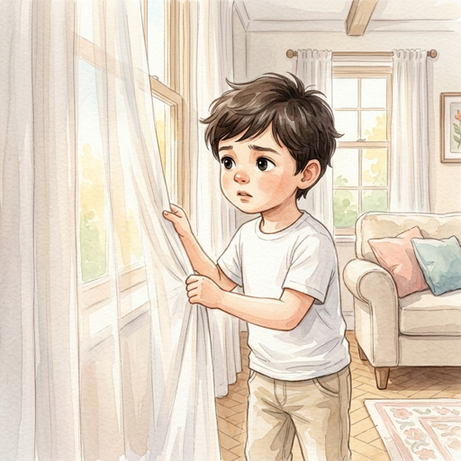
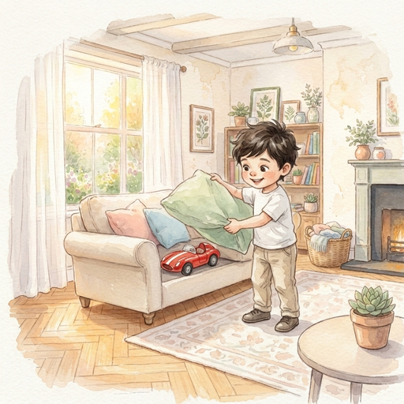
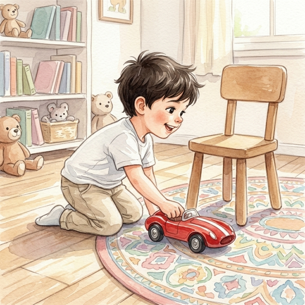

Léo
---

Cette histoire est celle d'un petit garçon nommé Léo, qui cherche son jouet dans sa maison.

C'est une histoire extrêmement simple permettant de bien visualiser les différentes opérations que ``librito`` peut mener pour la convertir en un livre illustré.

.. note::

    Le contenu de cette section peut se retrouver dans les fichiers sources du projet dans le chemin ``./docs/examples/leo/``.

L'histoire
^^^^^^^^^^

    Léo a cinq ans, et son trésor, c'est une petite voiture rouge qu'il ne
    quitte jamais. Ce matin-là, impossible de la trouver. Il cherche partout,
    soulève les coussins, regarde derrière les rideaux… jusqu'à ce qu'il
    l'aperçoive, cachée sous le canapé du salon. Son visage s'illumine quand il
    la récupère enfin.

    Tout content, il file dans sa chambre pour jouer. Il fait rouler son bolide
    sur le parquet, invente des circuits autour des pieds de chaise et le long
    des bords du tapis. Les heures passent sans qu'il s'en rende compte.

    Quand la faim se fait sentir, Léo retourne au salon. Sa maman lui a préparé
    de bons gâteaux pour le goûter. Assis près d'elle, il les dévore avec
    appétit, sa petite voiture rouge serrée dans la main.

Scènes
^^^^^^

Cette histoire se découpe tout naturellement en trois scènes (une scène par paragraphe). Le fichier JSON correspondant est donc le suivant :

.. literalinclude:: story.json
   :language: json

Livre
^^^^^

Le livre final s'obtient en couplant chaque texte avec une description permettant de générer l'illustration correspondante. Nous présentons ci-dessous les différentes scènes avec leurs textes, leurs *prompts* et les images associées.

Scène 1
~~~~~~~

**Texte :**
   Léo a cinq ans, et son trésor, c'est une petite voiture rouge qu'il ne
   quitte jamais. Ce matin-là, impossible de la trouver. Il cherche partout,
   soulève les coussins, regarde derrière les rideaux… jusqu'à ce qu'il
   l'aperçoive, cachée sous le canapé du salon. Son visage s'illumine quand il
   la récupère enfin.

**Prompt d'illustration :**
   ``<LEO> kneels on the floor of the <LIVING_ROOM>, after searching everywhere, smiling with relief as he pulls his <TOY_CAR> from under the sofa.``

Scène 2
~~~~~~~

**Texte :**
   Tout content, il file dans sa chambre pour jouer. Il fait rouler son bolide
   sur le parquet, invente des circuits autour des pieds de chaise et le long
   des bords du tapis. Les heures passent sans qu'il s'en rende compte.

**Prompt d'illustration :**
   ``<LEO> plays in his bedroom, guiding his <TOY_CAR> across the parquet floor around chair legs and along the edge of a rug.``

Scène 3
~~~~~~~

**Texte :**
   Quand la faim se fait sentir, Léo retourne au salon. Sa maman lui a préparé
   de bons gâteaux pour le goûter. Assis près d'elle, il les dévore avec
   appétit, sa petite voiture rouge serrée dans la main.

**Prompt d'illustration :**
   ``<LEO> sits in the <LIVING_ROOM> at snack time, eating little cakes with appetite while holding his <TOY_CAR> tightly in one hand.``

