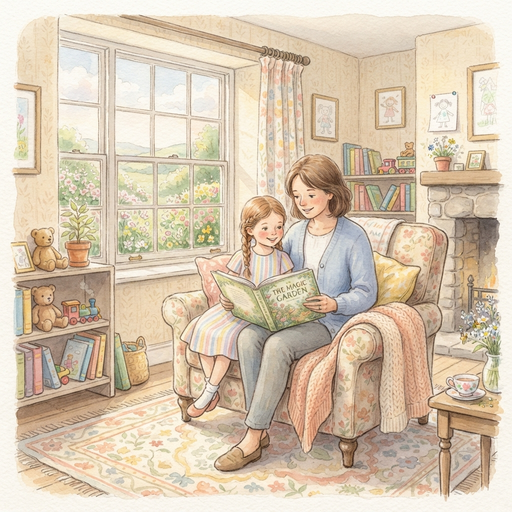
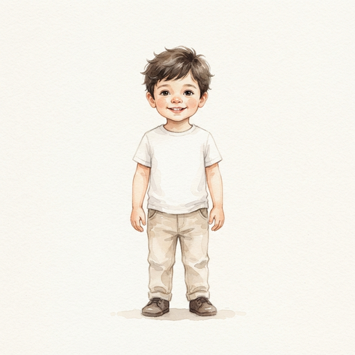
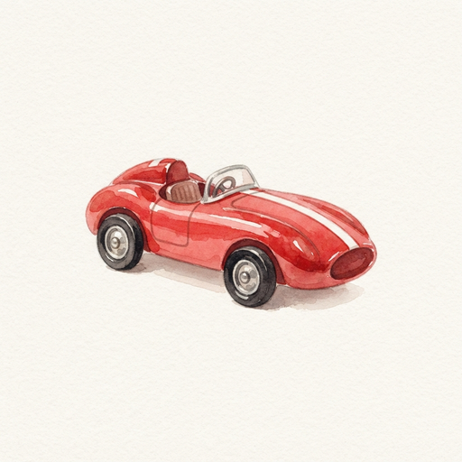
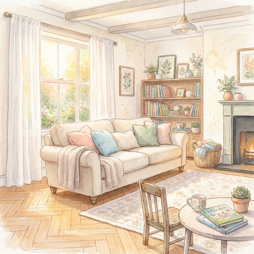
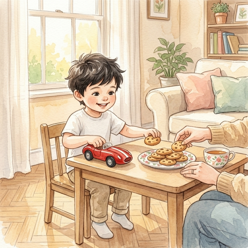
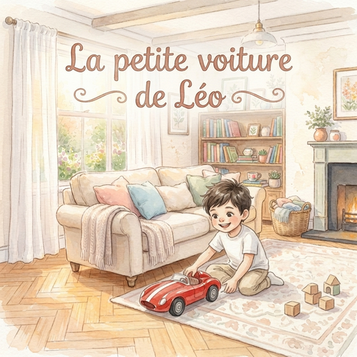
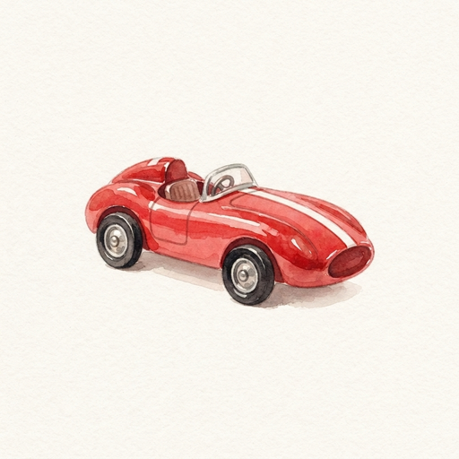
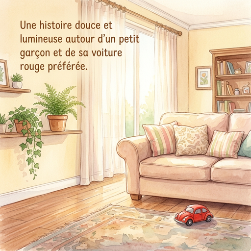

La petite voiture de Léo
========================

Suivez pas à pas la création d'un livre illustré avec ``librito`` ! À travers l'aventure de Léo, un petit garçon espiègle à la recherche de son trésor perdu, découvrez comment un texte brut prend vie pour devenir un véritable ouvrage prêt à feuilleter.

.. admonition:: Code source
    :class: note

    Retrouvez l'ensemble des fichiers sources, descriptors et illustrations dans le dossier ``./docs/examples/leo/``.

.. admonition:: Modèles utilisés
    :class: note

    Les images de cette exemple ont été générées à l'aide du modèle Nano Banana 2 proposé par Google (alias `gemini-3.1-flash-image` sur l'API Gemini).

L'histoire
----------

Tout commence par une histoire simple et touchante. Voici le texte original brut, directement issu du fichier ``story.md`` :

    .. include:: story.md
       :start-after: # La petite voiture de Léo

La structure
------------

Avant de manier les pinceaux numériques, il faut poser les fondations du récit !

Cette étape façonne l'ossature narrative et visuelle du futur livre en définissant deux éléments essentiels :

Le découpage narratif
^^^^^^^^^^^^^^^^^^^^^

Le texte est segmenté en quatre scènes équilibrées, chacune capturant une étape visuelle et émotionnelle forte :

1. **Scène 1 (L'inquiétude)** : Léo cherche partout son jouet sans succès et commence à s'inquiéter.
2. **Scène 2 (La découverte)** : En soulevant un coussin du canapé, le soulagement et la joie éclatent.
3. **Scène 3 (Le jeu)** : L'énergie débordante de l'enfance prend le dessus dans la chambre.
4. **Scène 4 (La gourmandise)** : Le retour au calme et le partage d'un moment chaleureux autour du goûter.

L'inventaire des concepts récurrents
^^^^^^^^^^^^^^^^^^^^^^^^^^^^^^^^^^^^

Pour que le lecteur reconnaisse instantanément les protagonistes d'une page à l'autre, les éléments appelés à réapparaître sont identifiés et balisés dès cette étape :

* **Les sujets** :
    * ``<LEO>`` : notre jeune héros, au cœur de chaque instant (présent dans les scènes 1, 2, 3 et 4).
    * ``<TOY_CAR>`` : le petit bolide rouge, objet de toutes les attentions (présent dans les scènes 2, 3 et 4).
* **L'environnement** :
    * ``<LIVING_ROOM>`` : le salon familial, théâtre de la recherche, des retrouvailles et du goûter (cadre des scènes 1, 2 et 4).

Ce canevas garantit que chaque illustration future disposera de repères clairs avant même d'entamer la production graphique.

La direction artistique
-----------------------

Donnons une âme graphique à notre aventure ! Pour que le livre soit harmonieux et immédiatement attachant, nous définissons d'abord un style global, puis nous générons les *artworks* de référence pour chaque concept.

Le style global
^^^^^^^^^^^^^^^

Nous optons pour une douceur intemporelle : l'aquarelle jeunesse, baignée de lumière chaude et de tons pastel.

**Direction artistique :**

    *Children's watercolor storybook illustration, soft expressive brushwork, warm natural light, gentle pastel colors, cozy home interiors, and charming storybook aesthetics.*

Cette intention visuelle prend corps avec notre image de référence :

Les sujets
^^^^^^^^^^

Chaque personnage ou objet clé dispose de son portrait de référence pour fixer ses traits une fois pour toutes :

**<LEO>** (présent dans les scènes 1, 2, 3 et 4)

    *A 5-year-old boy with fair skin, short tousled dark brown hair, bright expressive dark eyes, and a cheerful round face, wearing a plain white crewneck t-shirt and light beige casual trousers.*

**<TOY_CAR>** (présente dans les scènes 2, 3 et 4)

    *A small bright red vintage toy race car with a smooth glossy rounded body, small black wheels, and a thin white racing stripe painted along the top. No visible number in the body.*

L'environnement
^^^^^^^^^^^^^^^

Le décor principal doit respirer la sérénité et la vie de famille :

**<LIVING_ROOM>** (cadre des scènes 1, 2 et 4)

    *A cozy, bright family living room with light oak parquet floors, pale cream walls, soft sheer curtains letting in warm daylight, and a large comfortable fabric sofa with soft cushions.*

La mise en scène
----------------

C'est ici que la magie opère ! Pour chaque scène, le texte narratif s'associe à un prompt de mise en scène. Grâce aux balises ``<LEO>``, ``<TOY_CAR>`` et ``<LIVING_ROOM>``, l'IA sait exactement comment disposer les protagonistes tout en préservant fidèlement leur apparence.

Scène 1 : L'inquiétude des rideaux
^^^^^^^^^^^^^^^^^^^^^^^^^^^^^^^^^^

**Texte de la scène :**

    .. include:: story.md
       :start-after: # La petite voiture de Léo
       :end-before: En s'approchant du grand canapé

**Prompt de mise en scène :**

    *<LEO> searches anxiously around the <LIVING_ROOM>, peeking behind the light sheer curtains with a puzzled and focused expression, looking for his lost toy.*

.. image:: illustrations/scene-001.png
   :alt: Léo cherche sa petite voiture derrière les rideaux du salon.
   :width: 80%
   :align: center

Scène 2 : La trouvaille sous le coussin
^^^^^^^^^^^^^^^^^^^^^^^^^^^^^^^^^^^^^^^

**Texte de la scène :**

    .. include:: story.md
       :start-after: Mais la petite voiture reste introuvable.
       :end-before: Tout joyeux, Léo file dans sa chambre

**Prompt de mise en scène :**

    *<LEO> stands by the comfortable sofa in the <LIVING_ROOM>, joyfully lifting a large soft cushion to reveal the <TOY_CAR> hidden underneath, his face beaming with a delighted smile.*

.. image:: illustrations/scene-002.png
   :alt: Léo retrouve sa petite voiture sous un coussin du canapé.
   :width: 80%
   :align: center

Scène 3 : Le grand prix dans la chambre
^^^^^^^^^^^^^^^^^^^^^^^^^^^^^^^^^^^^^^^

**Texte de la scène :**

    .. include:: story.md
       :start-after: Un large sourire illumine son visage.
       :end-before: Une délicieuse odeur de gâteaux

**Prompt de mise en scène :**

    *<LEO> happily kneeling on the wooden floor of his bright cozy child bedroom, pushing his <TOY_CAR> along the edge of a colorful play rug around wooden chair legs with pure excitement.*

.. image:: illustrations/scene-003.png
   :alt: Léo fait rouler sa voiture dans sa chambre.
   :width: 80%
   :align: center

Scène 4 : La pause gourmande
^^^^^^^^^^^^^^^^^^^^^^^^^^^^

**Texte de la scène :**

    .. include:: story.md
       :start-after: toute la matinée.

**Prompt de mise en scène :**

    *<LEO> sitting happily at a small wooden table in the sunlit <LIVING_ROOM>, holding his beloved <TOY_CAR> firmly in one hand while enjoying freshly baked golden cookies from a ceramic plate, warm maternal presence nearby.*

L'écrin final
-------------

Pour transformer une suite d'images en un véritable objet de lecture, ``librito`` habille l'histoire de ses atours éditoriaux.

Première de couverture
^^^^^^^^^^^^^^^^^^^^^^

L'affiche du livre ! Elle invite à l'aventure dès le premier regard avec un lettrage intégré au charme vintage.

**Prompt de couverture :**

    *Storybook cover illustration featuring <LEO> happily playing on the floor with his <TOY_CAR> in the warm daylight of the <LIVING_ROOM>. The title "La petite voiture de Léo" is beautifully and clearly written in storybook lettering at the top.*

.. note::

    Vous remarquerez que le titre du livre a été intégré au *prompt* envoyé au modèle de génération d'image afin qu'il fasse partie intégrante de l'image générée.
    Si le modèle sous-jacent n'est pas capable de générer du texte lisible et cohérent, il est possible, dans l'assemblage final du livre, d'utiliser l'option `overlay` et d'intégrer le texte par-dessus l'image.

    Cette option présente des avantages et des inconvénients : elle permet de contrôler précisément la police utilisée, mais le rendu final peut présenter quelques incohérences, avec le texte qui se superpose mal à l'image.

Page de titre
^^^^^^^^^^^^^

Une délicate vignette ouvre le bal avec élégance et sobriété :

**Prompt de la vignette :**

    *A small charming watercolor spot illustration of the <TOY_CAR> centered on a clean light surface with a soft delicate shadow, surrounded by generous empty space.*

Quatrième de couverture
^^^^^^^^^^^^^^^^^^^^^^^

Le livre se referme sur une atmosphère paisible, illuminée par le soleil déclinant :

**Texte d'accroche :**

    Une histoire douce et lumineuse autour d'un petit garçon et de sa voiture rouge préférée.

**Prompt de quatrième de couverture :**

    A peaceful and sun-drenched family living room with afternoon light streaming through sheer curtains, illuminating an inviting sofa with plush cushions, a warm polished wooden floor, house plants on shelves, and a gentle tranquil home ambiance. In the upper left of the image, the teaser text is clearly and beautifully written in storybook lettering: "Une histoire douce et lumineuse autour d'un petit garçon et de sa voiture rouge préférée."

.. admonition:: Remarque
    :class: note

    Tout comme pour la première de couverture, nous utilisons les capacités de génération de texte cohérent du modèle générateur d'image pour intégrer directement la phrase d'accroche à l'image.

L'assemblage EPUB
^^^^^^^^^^^^^^^^^

Textes, pages de garde, scènes en vis-à-vis et illustrations sont enfin réunis en un fichier ``story.epub`` à mise en page fixe (*fixed-layout*). 

Sur tablette ou liseuse, le livre est prêt à émerveiller petits et grands !

Storybook complet
-----------------

Toutes les briques élaborées au fil de ces étapes — métadonnées, style artistique, inventaire des concepts, éléments éditoriaux et scènes illustrées — sont réunies dans le fichier central ``story.json``. 

C'est ce document canonique qui pilote l'ensemble des scripts de génération et d'assemblage :

.. literalinclude:: story.json
   :language: json
